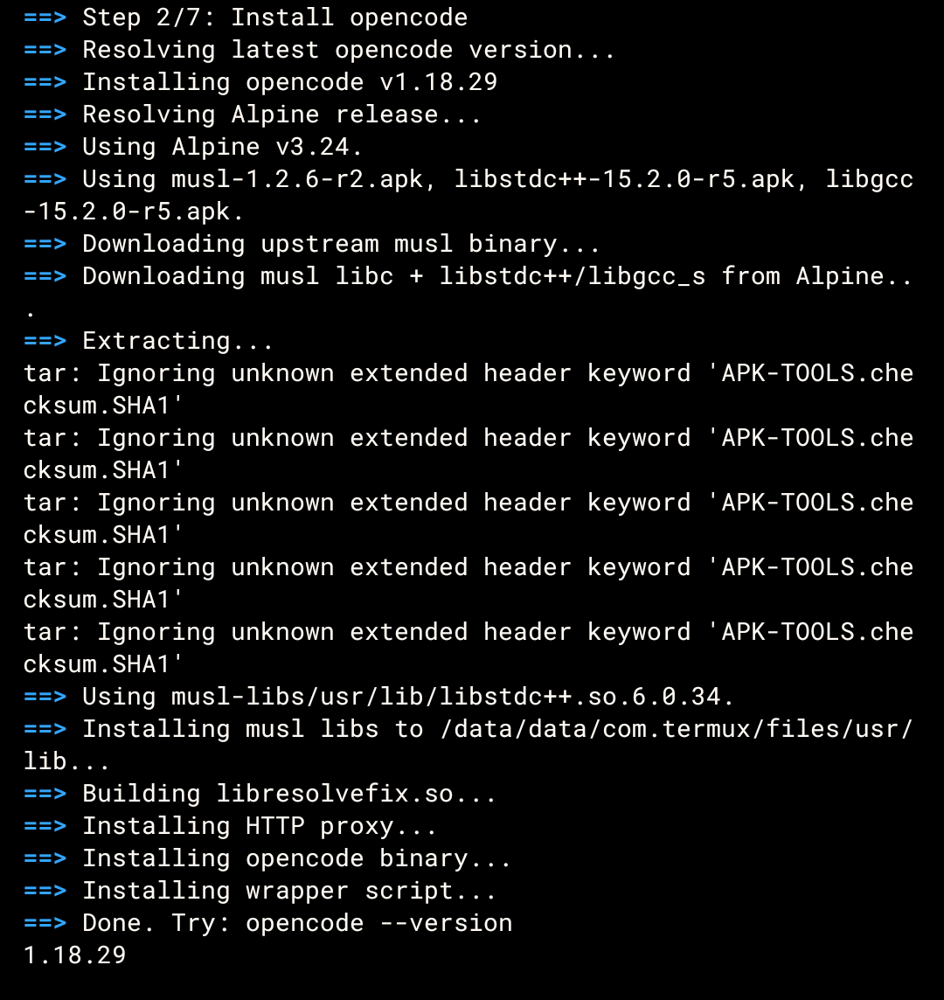
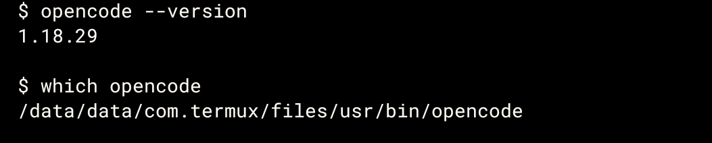
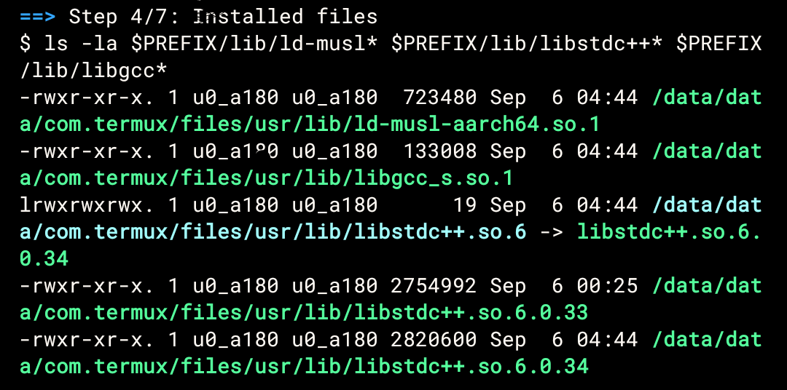
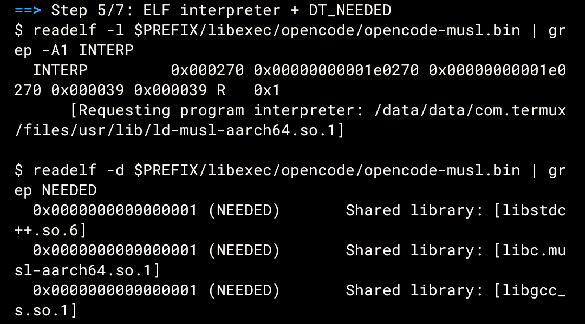
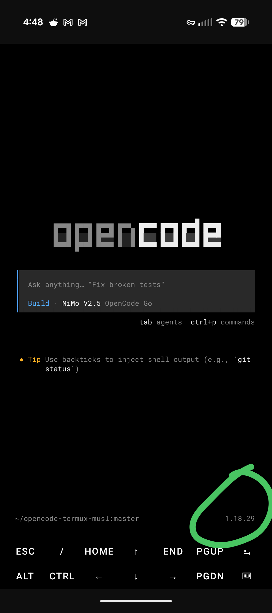

# opencode-termux-musl

Run the **upstream [opencode](https://github.com/anomalyco/opencode) CLI** on Termux / Android (aarch64) by reusing its official musl-linked ARM64 binary.

This is an alternative to [guysoft/opencode-termux](https://github.com/guysoft/opencode-termux), which cross-compiles Bun from source for Android and is pinned to opencode 1.17.9. This project avoids that build entirely.

## Why

opencode is a Bun standalone binary. The Bun team has [closed Android support as "not planned"](https://github.com/oven-sh/bun/issues/9), so running opencode on Termux normally requires:

1. Cross-compiling Bun v1.2.13 for Android/aarch64 (~30 min CMake build)
2. Cross-compiling WebKit/JavaScriptCore (~90 min)
3. Cross-compiling ICU, TinyCC, OpenTUI
4. Splicing the host-built opencode module graph onto the Android Bun binary
5. Patching the bionic heap-tagging ABI for JSC

That's a 6-stage CI pipeline. It works, but it's a maintenance burden and the maintainer of [guysoft/opencode-termux](https://github.com/guysoft/opencode-termux) has not published a release since opencode 1.17.9 (June 2026), even though upstream has shipped 11+ versions since then.

The much simpler approach: take upstream's `opencode-linux-arm64-musl.tar.gz`, supply a musl dynamic linker + musl-compiled libstdc++/libgcc_s from Alpine, patch the interpreter, done.

## Install

On Termux:

```sh
curl -fsSL https://raw.githubusercontent.com/DEAD1nsane/opencode-termux-musl/master/install.sh | sh
```

After it finishes, the wrapper prints the installed opencode version (whatever upstream's current release is).

Then run:

```sh
opencode --version
opencode
```

## How it works

The upstream binary is dynamically linked. Its ELF interpreter points at `/lib/ld-musl-aarch64.so.1`, which Termux doesn't ship. The installer:

1. Downloads the latest upstream `opencode-linux-arm64-musl.tar.gz`.
2. Downloads Alpine's musl package (provides `ld-musl-aarch64.so.1`) and musl-compiled `libstdc++` / `libgcc_s`.
3. Installs them to `$PREFIX/lib`.
4. Uses `patchelf` to retarget the binary's interpreter to the installed musl loader.
5. Builds and installs `libresolvefix.so` — an LD_PRELOAD shim that:
   - Redirects musl's `/etc/resolv.conf` reads to Termux's copy at `$PREFIX/etc/resolv.conf`
   - Forwards `getaddrinfo()` to bionic's resolver (via `dlopen`) so DNS works through Android's `netd` daemon
6. Installs a local HTTP proxy (`proxy.py`) — Bun's io_uring-based networking doesn't work on Android, so all outbound traffic (API requests, webfetch, websearch, model registry, plugin installs, etc.) is routed through a Python proxy on `127.0.0.1:8080`
7. Installs a wrapper that:
   - Clears any stale `LD_PRELOAD` from the previous (guysoft) wrapper — that shim references glibc-only symbols (`__register_atfork`, `__errno`, `__strlen_chk`, etc.) that don't exist in musl
   - Loads `libresolvefix.so` for DNS resolution
   - Auto-starts the HTTP proxy if not running
   - Sets the env vars opencode needs on Android: `TERM` for the TUI, `OPENCODE_DISABLE_TUI_AUDIO=1`, `OPENCODE_EXPERIMENTAL_DISABLE_FILEWATCHER=true`, TLS cert paths
   - Sets `HTTP_PROXY`/`HTTPS_PROXY` so Bun routes all connections through the proxy
   - Runs the binary against the musl loader in `$PREFIX/lib`

### Why a proxy?

Bun uses [io_uring](https://kernel.dk/io_uring.pdf) for async networking (DNS, TCP, TLS) on Linux. On Android, io_uring is either unavailable or broken — all outbound connections fail with "Unable to connect". The Python proxy works because it uses standard libc sockets (bionic's `connect()`/`sendto()`) which go through Android's normal networking stack. The proxy supports three modes:

1. **Fixed-target reverse proxy** (for the opencode.ai API): requests to `127.0.0.1:8080` are forwarded to `https://opencode.ai<path>`
2. **Absolute-URL forward proxy**: when Bun sends `GET http://...` requests (because `HTTP_PROXY` is set), the proxy extracts the target URL and forwards
3. **HTTP CONNECT tunnel**: for HTTPS targets, the proxy establishes a TCP tunnel to the remote host and pipes bytes both ways

### Why `libresolvefix.so`?

Musl's resolver reads `/etc/resolv.conf` then sends raw UDP DNS queries to the nameserver. On Android, `/etc` is read-only and raw UDP to port 53 is blocked by the firewall. The shim:

1. Intercepts `open()`/`fopen()` for `/etc/resolv.conf` and redirects to Termux's copy
2. Intercepts `getaddrinfo()` and forwards to bionic's implementation (loaded via `dlopen("libc.so")`) which uses Android's `netd` daemon for proper DNS resolution

## Why no `libtagfix.so` shim

The other Termux build ([guysoft/opencode-termux](https://github.com/guysoft/opencode-termux)) ships an `LD_PRELOAD` shim that calls `mallopt()` to disable Android's bionic heap-pointer tagging. That build is Bionic-linked, so its allocator is bionic's — and bionic's allocator tags heap pointers with the top byte, which JSC's NaN-boxing clobbers, causing a `Pointer tag ... was truncated` abort on `free()`.

This build is **musl-linked**. opencode's allocations go through musl's allocator, which does not tag pointers. The shim is therefore unnecessary here, and shipping a Bionic-targeted `.so` under a musl process would either fail to load (different libc resolution) or cause a libc-mismatch corruption. If you do hit a "Pointer tag" crash, the cause is different (e.g. kernel-level tagged-address enforcement on `ioctl`/`prctl` from a JSC path) and would need to be fixed in JSC's syscall wrappers upstream, not in userspace.

## What's not working

Known limitations:

- **File watcher**: `@parcel/watcher`'s native binding is x86_64-only; this build has the same issue. Disabled in the wrapper via `OPENCODE_EXPERIMENTAL_DISABLE_FILEWATCHER=true`.
- **TUI audio**: explicitly disabled in the wrapper (`OPENCODE_DISABLE_TUI_AUDIO=1`) since OpenTUI's audio backend isn't useful on Android.
- **PTY support**: depends on `librust_pty_arm64.so`. The guysoft build ships this; we don't yet. PRs welcome.
- **Startup latency**: the Python HTTP proxy adds ~100-200ms per request. Acceptable for interactive use.

## OpenCode v2 (beta)

OpenCode v2 is a major rewrite that replaces Bun with Node.js as the JavaScript runtime. The v2 musl binary (`linux-arm64-musl`) works on Termux with the same musl loader used by this project — and it's significantly simpler since it doesn't need the Bun/io_uring proxy workaround.

**Tested and confirmed working**: `opencode2 v0.0.0-beta-19192` runs on Termux aarch64.

```sh
# Install v2 side-by-side with v1 (beta — requires --force to bypass OS check)
npm install -g @opencode-ai/cli@beta --force

# Run
opencode2 --version
```

**Why --force?** The npm package doesn't declare `android` as a supported OS, so npm rejects the install. Use `--force` to bypass.

**v1 vs v2 on Termux:**

| | v1 (stable) | v2 (beta) |
|---|---|---|
| Runtime | Bun | Node.js |
| Proxy needed | Yes (io_uring broken on Android) | No |
| libresolvefix needed | Yes (musl DNS) | Yes (musl DNS) |
| Install method | `install.sh` (this project) | `npm install -g --force` |
| Status | Stable, production-ready | Beta, untested long-term |

**Status**: v2 works but is still in beta. This project remains the stable solution for v1. If v2 reaches stable and works reliably on Android, this project may become unnecessary — but until then, the proxy approach is the only confirmed way to run opencode on Termux.

## Requirements

- Termux (Android 7.0+ / API 24+, aarch64)
- `curl`, `tar`, `patchelf`, `clang` (installer will install `patchelf` and `clang` automatically if missing)
- `python3` (for the HTTP proxy — v1 only)
- Internet access to `github.com`, `dl-cdn.alpinelinux.org`, and `opencode.ai`

## Tested on

- Pixel 10 (Android 17, Termux 0.119, aarch64) — installer completes, wrapper prints upstream's version string, TUI launches and connects to API through the proxy.
- v2 (`opencode2 v0.0.0-beta-19192`) runs on the same device using the musl loader from this project.

<details>
<summary><strong>Screenshots</strong> (click to expand)</summary>

| Step | Screenshot |
|------|------------|
| Clean terminal |  |
| Install opencode |  |
| Version check |  |
| Installed files |  |
| ELF interpreter |  |
| opencode TUI |  |
| Running opencode |  |
| Newest version |  |

</details>

## Credits

- [opencode](https://github.com/anomalyco/opencode) by [Anomaly](https://anoma.ly) — the AI coding CLI this project wraps
- [guysoft/opencode-termux](https://github.com/guysoft/opencode-termux) — the original Android port and Bionic compatibility shims that informed this work
- [Alpine Linux](https://alpinelinux.org/) — musl libc + libstdc++/libgcc_s packages

## License

MIT
